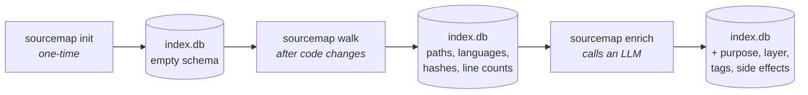
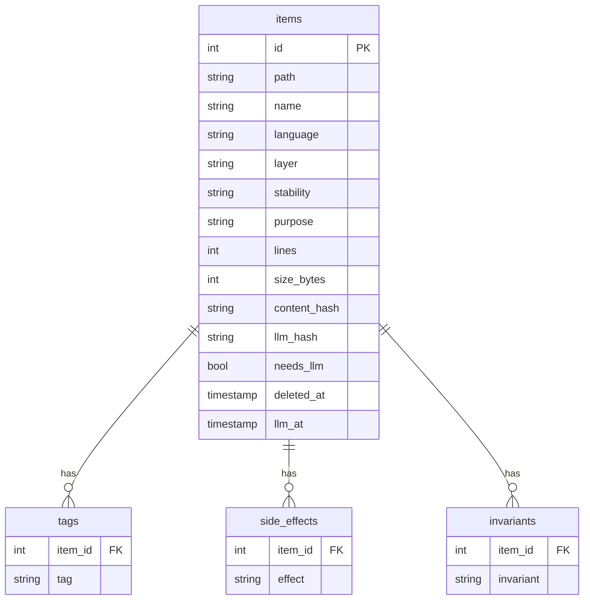

<a id="topo"></a>

## sourcemap-indexer

*Index any codebase into SQLite and enrich file metadata via an LLM — so an AI assistant can understand large projects through SQL queries instead of reading every file.*

---

## Index

| # | Section |
|---|---------|
| 1 | [How it works](#overview) |
| 2 | [Prerequisites](#prerequisites) |
| 3 | [Installation](#installation) |
| 4 | [Quickstart](#quickstart) |
| 5 | [Commands](#commands) |
| 6 | [Environment variables](#env) |
| 7 | [Ignoring files](#ignoring) |
| 8 | [Plugging in a different LLM](#llm) |
| 9 | [AI assistant skill](#skill) |
| 10 | [Post-commit hook](#hook) |
| 11 | [SQLite schema](#schema) |
| 12 | [Dev setup](#dev) |

---

<a id="overview"></a>

## 1. How it works

sourcemap-indexer runs in three phases. Each phase writes into the same SQLite database, adding a new layer of information on top of what the previous phase produced:



> [!NOTE]
> `init` and `walk` are fully offline — no LLM required. Only `enrich` calls an external model.

### Phase 1 — `sourcemap init`

Creates the directory structure needed by the other commands:

```
your-project/
├── .docs/
│   ├── maps/
│   │   ├── index.db          ← SQLite database (all metadata lives here)
│   │   └── index.yaml        ← YAML snapshot of the last walk (intermediate file)
│   └── logs/                 ← LLM debug logs (only when SOURCEMAP_LLM_LOG=1)
└── .sourcemapignore          ← gitignore-syntax exclusion rules
```

> [!NOTE]
> The output directory defaults to `.docs/maps/` and can be changed via `SOURCEMAP_MAPS_DIR`. See [Environment variables](#env).

> [!NOTE]
> `init` is idempotent — safe to run multiple times. It never overwrites an existing `.sourcemapignore` or database.

### Phase 2 — `sourcemap walk`

Scans the project tree and updates the database in three internal steps:

1. **Scan** — traverses all files (respecting `.gitignore` and `.sourcemapignore`), collects path, language, line count, size, content hash, and last-modified timestamp
2. **Write** — serializes the result to `index.yaml` inside the maps directory (human-readable snapshot of every tracked file)
3. **Sync** — reads `index.yaml` and reconciles the SQLite database:
   - New file → inserted with `needs_llm = true`
   - File changed (hash diff) → updated with `needs_llm = true`
   - File removed → soft-deleted (kept in DB with `deleted_at` timestamp)
   - File unchanged → skipped

<details>
<summary>What index.yaml looks like</summary>

```yaml
version: 1
generated_at: 1745000000
root: /path/to/your-project
files:
  - path: src/auth/login.ts
    language: ts
    lines: 82
    size_bytes: 2104
    content_hash: a3f1...
    last_modified: 1744900000
  - path: src/auth/logout.ts
    ...
```

This file is checked in to source control optionally — it gives a plain-text audit trail of what was indexed.

</details>

#### What you get without an LLM

After `walk`, the database already holds language, line count, size, and hash for every file. Run `sourcemap profile` to turn that into a structural overview:

```
Stack            py  46 files  4289 lines  ██████████████████
                 sh   6 files   312 lines  ██
Inferred layers  test       22 files  2456 lines
                 infra      10 files   667 lines
                 application 8 files   513 lines
Test ratio       Source 27 / Tests 22   (ratio 1.29× — healthy)
Top files        src/sourcemap_indexer/cli.py   500 lines
```

Layers are inferred from directory names (`domain/`, `infra/`, `tests/`, …). For LLM-assigned layers, use `sourcemap overview` after `enrich`.

### Phase 3 — `sourcemap enrich`

For every file marked `needs_llm = true`, enrichment:

1. **Reads** the file content from disk
2. **Sends** path + language + content to the LLM with a structured prompt
3. **Stores** the LLM response back into SQLite:

| Field | What it contains |
|-------|-----------------|
| `purpose` | One-sentence description of what the file does |
| `layer` | Architectural layer (`domain`, `infra`, `application`, `cli`, `lib`, …) |
| `stability` | `core`, `stable`, `experimental`, or `deprecated` |
| `tags` | Semantic keywords (e.g. `authentication`, `rate-limiting`) |
| `side_effects` | I/O boundaries (`network`, `writes_fs`, `git`, `spawns_process`) |
| `invariants` | Key behavioral contracts the file upholds |

After enrichment, `needs_llm` is cleared and `llm_hash` is set to the content hash at the time of enrichment — so future walks can detect drift.

> [!IMPORTANT]
> Enrichment calls the LLM for every pending file. For large codebases, use `--limit N` to process in batches and avoid timeouts or rate limits.

> [!NOTE]
> Set `SOURCEMAP_LLM_LOG=1` to record every LLM request and response to a timestamped YAML file in `.docs/logs/`. Each `enrich` session produces one file (`llm-YYYYMMDD-HHMMSSffffff.yaml`) containing one YAML document per enriched file — useful for debugging prompts or auditing model output.

[↑ back to top](#topo)

---

<a id="prerequisites"></a>

## 2. Prerequisites

| Requirement | Version | Notes |
|-------------|---------|-------|
| [uv](https://docs.astral.sh/uv/) | any | Used for installation and tool management |
| Python | 3.11+ | Managed automatically by `uv tool install` |
| An OpenAI-compatible LLM | — | Required only for `sourcemap enrich` |

> [!NOTE]
> `uv tool install` pulls the correct Python version automatically. You do not need to install Python separately.

> [!IMPORTANT]
> `sourcemap enrich` calls an LLM. Without a reachable endpoint (`SOURCEMAP_LLM_URL`), walk and stats work fine — only enrichment is blocked.

[↑ back to top](#topo)

---

<a id="installation"></a>

## 3. Installation

```bash
uv tool install "git+https://github.com/lipex360x/sourcemap-indexer.git@main"
```

To upgrade:

```bash
uv tool upgrade sourcemap-indexer
```

To uninstall:

```bash
uv tool uninstall sourcemap-indexer
```

The binary lives at `~/.local/bin/sourcemap`. The tool environment is at `~/.local/share/uv/tools/sourcemap-indexer/`.

[↑ back to top](#topo)

---

<a id="quickstart"></a>

## 4. Quickstart

```bash
cd <your-project>
sourcemap init    # create .docs/maps/, .sourcemapignore, index.db
sourcemap walk    # scan files and sync into SQLite
sourcemap enrich  # call LLM to annotate each file
sourcemap stats   # auto-walks first, then shows totals and pending files
```

> [!NOTE]
> `sourcemap stats` automatically runs `walk` before displaying data — no need to run `walk` manually before `stats`.

[↑ back to top](#topo)

---

<a id="commands"></a>

## 5. Commands

### Setup

| Command | Description |
|---------|-------------|
| `sourcemap init` | Create the maps directory, `.sourcemapignore`, and `index.db` |
| `sourcemap walk` | Scan files and sync metadata into SQLite |

### Enrichment

| Command | Description |
|---------|-------------|
| `sourcemap enrich [--limit N]` | Send pending files to the LLM (validates reachability first) |
| `sourcemap enrich --force` | Re-enrich already enriched files (e.g. to fix language or layer) |
| `sourcemap enrich --file <path>` | Re-enrich a single specific file |
| `sourcemap enrich --layer unknown` | Target only files in a specific layer |
| `sourcemap enrich --language other` | Target only files in a specific language |
| `sourcemap enrich -m "<instruction>"` | Inject an extra instruction into the LLM prompt |
| `sourcemap stale` | List files whose content changed since the last enrich run |

### Exploration

| Command | Description |
|---------|-------------|
| `sourcemap profile` | Structural overview from walk data only — language distribution, inferred layers, test ratio, top files by size |
| `sourcemap stats [--page N]` | Auto-runs walk, then shows total/enriched/pending counts by layer and language; displays a `●○` progress bar that disappears (`transient`) before stats output is printed |
| `sourcemap overview` | Layer × language matrix |
| `sourcemap domain` | Enriched domain-layer files with their purpose |
| `sourcemap effects` | Files with network or git side effects |
| `sourcemap tags` | Top 30 semantic tags by frequency |
| `sourcemap unstable` | Experimental or deprecated files |
| `sourcemap find [--tag T] [--layer L] [--language L]` | Search by tag, layer, or language |
| `sourcemap show <path>` | Full metadata for a specific file |
| `sourcemap query "<sql>"` | Free-form SQL against the index database |

### Maintenance

| Command | Description |
|---------|-------------|
| `sourcemap reset` | Delete the index (offers a timestamped backup before wiping) |
| `sourcemap restore` | Restore `index.db` from a previously saved `.bak` file |
| `sourcemap install-skill --target <dir>` | Copy the skill file to your AI assistant's skills directory |

[↑ back to top](#topo)

---

<a id="env"></a>

## 6. Environment variables

| Variable | Default | Description |
|----------|---------|-------------|
| `SOURCEMAP_LLM_URL` | _(required)_ | LLM endpoint (any OpenAI-compatible API) — `enrich` is blocked until this is set |
| `SOURCEMAP_LLM_MODEL` | `qwen/qwen3-coder-30b` | Model name passed to the endpoint |
| `SOURCEMAP_LLM_API_KEY` | _(empty)_ | Bearer token for authenticated providers |
| `SOURCEMAP_LLM_LOG` | _(off)_ | Set to `1` to write LLM request/response logs to `.docs/logs/` |
| `SOURCEMAP_PAGE_SIZE` | `20` | Number of pending files shown per page in `stats` |
| `SOURCEMAP_MAPS_DIR` | `.docs/maps` | Output directory for `index.db` and `index.yaml` — relative to project root or absolute |

`sourcemap enrich` automatically reads a `.env` file from the project root before resolving env vars:

```ini
# .env  (add to .gitignore)
SOURCEMAP_LLM_URL=https://api.z.ai/api/coding/paas/v4/chat/completions
SOURCEMAP_LLM_MODEL=glm-5.1
SOURCEMAP_LLM_API_KEY=your-api-key
```

> [!NOTE]
> Variables already present in the shell environment take precedence over `.env` values.

[↑ back to top](#topo)

---

<a id="ignoring"></a>

## 7. Ignoring files

`.sourcemapignore` uses the same syntax as `.gitignore`. Both files are read automatically — no extra config needed.

<details>
<summary>Built-in defaults (always excluded)</summary>

```
node_modules/   .git/         .venv/        __pycache__/
dist/           build/        .next/        .turbo/
coverage/       .docs/maps/   *.pyc         *.min.js
*.lock          *.db          *.sqlite      *.map
```

> If you change `SOURCEMAP_MAPS_DIR`, add your custom directory here too so it is not indexed.

</details>

**Add project-specific patterns** to `.sourcemapignore`:

```gitignore
# exclude by extension
*.png
*.jpg
*.svg
*.ico
*.woff2

# exclude directories
secrets/
storybook-static/
public/assets/

# exclude specific files
src/generated/schema.ts
```

Pattern rules:

| Pattern | Effect |
|---------|--------|
| `*.png` | All `.png` files anywhere in the tree |
| `assets/` | Entire directory (trailing slash = directory) |
| `src/generated/` | Subdirectory under a specific path |
| `#` at line start | Comment — line is ignored |

[↑ back to top](#topo)

---

<a id="llm"></a>

## 8. Plugging in a different LLM

The enrichment client targets any OpenAI-compatible endpoint:

```bash
# OpenAI
export SOURCEMAP_LLM_URL=https://api.openai.com/v1/chat/completions
export SOURCEMAP_LLM_MODEL=gpt-4o
export SOURCEMAP_LLM_API_KEY=sk-...

# OpenRouter (free tier available)
export SOURCEMAP_LLM_URL=https://openrouter.ai/api/v1/chat/completions
export SOURCEMAP_LLM_MODEL=deepseek/deepseek-r1:free
export SOURCEMAP_LLM_API_KEY=sk-or-...

# Local (LM Studio)
export SOURCEMAP_LLM_URL=http://localhost:1234/v1/chat/completions
export SOURCEMAP_LLM_MODEL=your-loaded-model-name
# SOURCEMAP_LLM_API_KEY not needed for local

sourcemap enrich --limit 10
```

[↑ back to top](#topo)

---

<a id="skill"></a>

## 9. AI assistant skill

Install the bundled skill file so your AI assistant can query the index directly:

```bash
# Claude Code
sourcemap install-skill --target ~/.claude/skills

# Any other tool — point to its skills directory
sourcemap install-skill --target <your-tool-skills-dir>
```

[↑ back to top](#topo)

---

<a id="hook"></a>

## 10. Post-commit hook (auto-walk on every commit)

```bash
bash scripts/bash/install-hook.sh
```

Installs a `post-commit` hook that runs `sourcemap walk` after every commit, keeping the index current.

> [!NOTE]
> Enrichment is not automatic — it calls the LLM and can be slow. Run `sourcemap enrich` manually when you want updated metadata.

[↑ back to top](#topo)

---

<a id="schema"></a>

## 11. SQLite schema

One core table (`items`) holds a row per file. Three satellite tables store the multi-valued LLM output (a file has many tags, many side effects, many invariants):



**Walk fills**: `path`, `name`, `language`, `lines`, `size_bytes`, `content_hash`, `needs_llm`, `deleted_at`.
**Enrich fills**: `purpose`, `layer`, `stability`, `llm_hash`, `llm_at`, plus rows in `tags` / `side_effects` / `invariants`.

Layers: `domain | infra | application | cli | hook | lib | config | doc | test | unknown`

Side effects: `writes_fs | spawns_process | network | git | environ`

[↑ back to top](#topo)

---

<a id="dev"></a>

## 12. Dev setup

```bash
git clone https://github.com/lipex360x/sourcemap-indexer.git
cd sourcemap-indexer
uv sync
uv run pytest
```

[↑ back to top](#topo)
