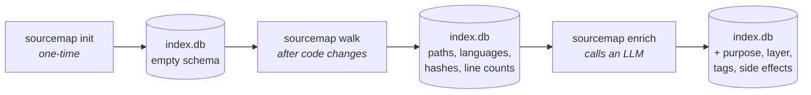
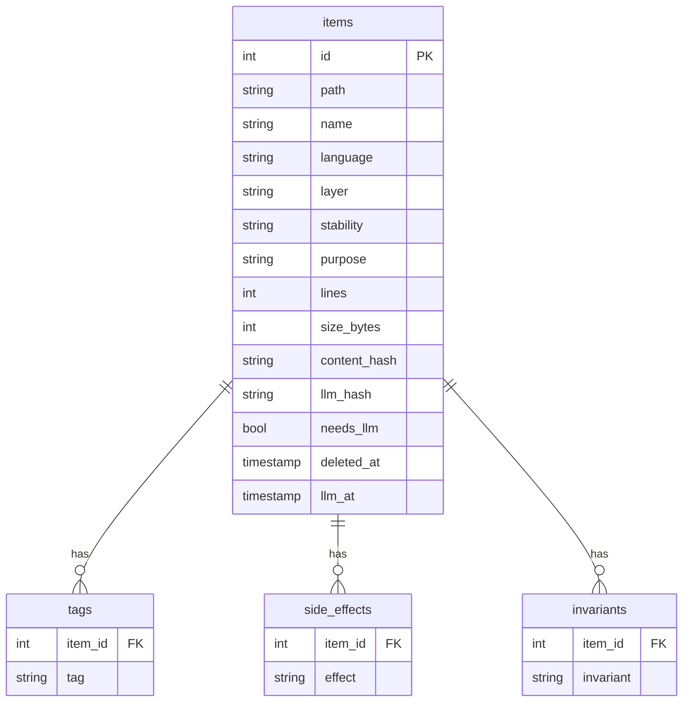

<a id="top"></a>

## sourcemap-indexer

[](https://www.python.org/)
[](https://docs.astral.sh/uv/)
[](LICENSE)
[](https://github.com/lipex360x/sourcemap-indexer)
[](https://github.com/lipex360x/sourcemap-indexer)
[](https://github.com/astral-sh/ruff)
[](https://mypy.readthedocs.io/)

*Index any codebase into SQLite and enrich file metadata via an LLM — so an AI assistant can understand large projects through SQL queries instead of reading every file.*

---

## Index

| # | Section |
|---|---------|
| 1 | [How it works](#overview) |
| 2 | [Prerequisites](#prerequisites) |
| 3 | [Installation](#installation) |
| 4 | [Quickstart](#quickstart) |
| 5 | [Commands](#commands) |
| 6 | [Environment variables](#env) |
| 7 | [Ignoring files](#ignoring) |
| 8 | [Custom layers](#layers) |
| 9 | [Plugging in a different LLM](#llm) |
| 10 | [AI assistant skill](#skill) |
| 11 | [Post-commit hook](#hook) |
| 12 | [SQLite schema](#schema) |
| 13 | [Dev setup](#dev) |
| 14 | [Code quality](#quality) |

---

<a id="overview"></a>

## 1. How it works

sourcemap-indexer runs in three phases. Each phase writes into the same SQLite database, adding a new layer of information on top of what the previous phase produced:



> [!NOTE]
> `init` and `walk` are fully offline — no LLM required. Only `enrich` calls an external model.

### Phase 1 — `sourcemap init`

Creates the directory structure needed by the other commands:

```
your-project/
├── .sourcemap/
│   ├── index.db          ← SQLite database (all metadata lives here)
│   ├── index.yaml        ← YAML snapshot of the last walk (intermediate file)
│   ├── layers.yaml       ← user-defined layer names (optional)
│   └── logs/             ← LLM debug logs (only when SOURCEMAP_LLM_LOG=1)
└── .sourcemapignore      ← gitignore-syntax exclusion rules
```

> [!NOTE]
> The output directory defaults to `.sourcemap/` and can be changed via `SOURCEMAP_MAPS_DIR`. See [Environment variables](#env).

> [!NOTE]
> `init` is idempotent — safe to run multiple times. It never overwrites an existing `.sourcemapignore` or database.

### Phase 2 — `sourcemap walk`

Scans the project tree and updates the database in three internal steps:

1. **Scan** — traverses all files (respecting `.gitignore` and `.sourcemapignore`), collects path, language, line count, size, content hash, and last-modified timestamp. On the second and subsequent runs, files whose `mtime` and `size` match the SQLite record are skipped entirely — only changed files are read and re-hashed. This makes `walk` scale to large codebases: a 10 000-file tree with 5 changed files reads 5 files instead of 10 000.
2. **Write** — serializes the result to `index.yaml` inside `.sourcemap/` (human-readable snapshot of every tracked file; planned for removal in a future release once SQLite becomes the sole source of truth)
3. **Sync** — reads `index.yaml` and reconciles the SQLite database:
   - New file → inserted with `needs_llm = true`
   - File changed (hash diff) → updated with `needs_llm = true`
   - File removed → soft-deleted (kept in DB with `deleted_at` timestamp)
   - File unchanged → skipped

<details>
<summary>What index.yaml looks like</summary>

```yaml
version: 1
generated_at: 1745000000
root: /path/to/your-project
files:
  - path: src/auth/login.ts
    language: ts
    lines: 82
    size_bytes: 2104
    content_hash: a3f1...
    last_modified: 1744900000
  - path: src/auth/logout.ts
    ...
```

This file is checked in to source control optionally — it gives a plain-text audit trail of what was indexed.

</details>

#### What you get without an LLM

After `walk`, the database already holds language, line count, size, and hash for every file. Run `sourcemap stats` to see the structural breakdown:

```
╭─ Sync ──────────────────────────────────────────────────────────╮
│ Inserted: 298   Updated: 0   Soft-deleted: 0                    │
╰─────────────────────────────────────────────────────────────────╯
╭─ Stats ─────────────────────────────────────────────────────────╮
│ Root   /your/project                                            │
│ LLM    not configured                                           │
│ Total: 298      Enriched: 0      Pending: 298                   │
│ ○○○○○○○○○○○○○○○○○○○○  0%                                        │
╰─────────────────────────────────────────────────────────────────╯
╭─ By layer ──────────────────────────────────────────────────────╮
│   unknown   298  ○○○○○○○○○○○○○○○○○○○○                           │
╰─────────────────────────────────────────────────────────────────╯
╭─ By language ───────────────────────────────────────────────────╮
│   py      114  ○○○○○○○○○○○○○○○○○○○○                             │
│   tsx      46  ○○○○○○○○                                         │
│   ts       43  ○○○○○○○○                                         │
│   md        9  ○○                                               │
│   sql       9  ○○                                               │
│   yaml      8  ○                                                │
│   json      7  ○                                                │
╰─────────────────────────────────────────────────────────────────╯
              ● all enriched  |  ● has pending  |  ○ not yet enriched
```

All files start at layer `unknown` — layers are assigned by the LLM during `enrich`. Language detection is immediate and requires no enrichment.

### Phase 3 — `sourcemap enrich`

For every file marked `needs_llm = true`, enrichment:

1. **Reads** the file content from disk
2. **Sends** path + language + content to the LLM with a structured prompt
3. **Stores** the LLM response back into SQLite:

| Field | What it contains |
|-------|-----------------|
| `purpose` | One-sentence description of what the file does |
| `layer` | Architectural layer (`domain`, `infra`, `application`, `cli`, `lib`, …) |
| `stability` | `core`, `stable`, `experimental`, or `deprecated` |
| `tags` | Semantic keywords (e.g. `authentication`, `rate-limiting`) |
| `side_effects` | I/O boundaries (`network`, `writes_fs`, `git`, `spawns_process`) |
| `invariants` | Key behavioral contracts the file upholds |

After enrichment, `needs_llm` is cleared and `llm_hash` is set to the content hash at the time of enrichment — so future walks can detect drift.

> [!IMPORTANT]
> Enrichment calls the LLM for every pending file. For large codebases, use `--limit N` to process in batches and avoid timeouts or rate limits.

> [!NOTE]
> Set `SOURCEMAP_LLM_LOG=1` to record every LLM request and response to a timestamped YAML file. Logs land in `.sourcemap/logs/` by default (or inside the directory set by `SOURCEMAP_MAPS_DIR`). Each `enrich` session produces one file (`llm-YYYYMMDD-HHMMSSffffff.yaml`) containing one YAML document per enriched file — useful for debugging prompts or auditing model output.

[↑ back to top](#top)

---

<a id="prerequisites"></a>

## 2. Prerequisites

| Requirement | Version | Notes |
|-------------|---------|-------|
| [uv](https://docs.astral.sh/uv/) | any | Used for installation and tool management |
| Python | 3.11+ | Managed automatically by `uv tool install` |
| An OpenAI-compatible LLM | — | Required only for `sourcemap enrich` |

> [!NOTE]
> `uv tool install` pulls the correct Python version automatically. You do not need to install Python separately.

> [!IMPORTANT]
> `sourcemap enrich` calls an LLM. Without a reachable endpoint (`SOURCEMAP_LLM_URL`), walk and stats work fine — only enrichment is blocked.

### Installing uv

**macOS**

```bash
curl -LsSf https://astral.sh/uv/install.sh | sh
```

Or via Homebrew:

```bash
brew install uv
```

**Linux**

```bash
curl -LsSf https://astral.sh/uv/install.sh | sh
```

Add `~/.local/bin` to your `PATH` if not already present (the installer will prompt you).

**Windows**

```powershell
powershell -ExecutionPolicy ByPass -c "irm https://astral.sh/uv/install.ps1 | iex"
```

Or via WinGet:

```powershell
winget install --id=astral-sh.uv -e
```

After installation, restart your terminal and verify with `uv --version`.

[↑ back to top](#top)

---

<a id="installation"></a>

## 3. Installation

```bash
uv tool install "git+https://github.com/lipex360x/sourcemap-indexer.git@main"
```

To upgrade:

```bash
uv tool upgrade sourcemap-indexer
```

To uninstall:

```bash
uv tool uninstall sourcemap-indexer
```

The binary lives at `~/.local/bin/sourcemap`. The tool environment is at `~/.local/share/uv/tools/sourcemap-indexer/`.

[↑ back to top](#top)

---

<a id="quickstart"></a>

## 4. Quickstart

```bash
cd <your-project>
sourcemap init    # create .sourcemap/, .sourcemapignore, index.db
sourcemap walk    # scan files and sync into SQLite
sourcemap enrich  # call LLM to annotate each file
sourcemap stats   # auto-walks first, then shows totals and pending files
```

> [!NOTE]
> `sourcemap stats` automatically runs `walk` before displaying data — no need to run `walk` manually before `stats`.

[↑ back to top](#top)

---

<a id="commands"></a>

## 5. Commands

All commands are invoked as `sourcemap <command>`.

### Setup

| Command | Description |
|---------|-------------|
| `init` | Create the maps directory, `.sourcemapignore`, and `index.db` |
| `walk` | Scan files and sync metadata into SQLite |

### Enrichment

| Command | Description |
|---------|-------------|
| `enrich` | Send pending files to the LLM |
| `stale` | List files whose content changed since the last enrich run |

`enrich` flags:

| Flag | Description |
|------|-------------|
| `--limit N` | Process at most N files per run |
| `--force` | Re-enrich already enriched files |
| `--file <path>` | Target a single specific file |
| `--layer <layer>` | Filter by architectural layer |
| `--language <lang>` | Filter by language |
| `-m "<msg>"` | Inject an extra instruction into the LLM prompt |
| `--with-context` | Inject depth-1 import context from indexed dependencies into the prompt (Python, TypeScript, JavaScript, TSX; off by default) |
| `--export-llm-prompt` | Write the active prompt to a `.md` file before running (defaults to `maps dir/prompt.md`) |
| `--output <path>` | Destination `.md` file for `--export-llm-prompt` |

`--with-context` resolves each file's direct imports (depth 1 only), looks up their `purpose` from the SQLite index, and prepends a context block to the LLM prompt:

```
Context from direct imports:
- src/domain/cart.py: validates cart items and calculates totals
- src/infra/payment.py: handles Stripe API calls
```

Pending files are automatically sorted by their dependency graph (topological order) before enrichment — leaf files are processed first. This means `--with-context` produces non-empty context blocks in a **single pass**, even on a fresh index.

Supported languages: Python, TypeScript, JavaScript, TSX. For TS/JS/TSX, the extractor returns extension candidates (`.ts`, `.tsx`, `.js`, `.jsx`, `index.ts`, `index.tsx`) and the index disambiguates automatically. `export … from` re-exports and tsconfig path aliases are not resolved.

Constraints: depth 1 only (no transitive traversal); context is capped at 2000 characters — imports beyond the budget are dropped silently; unknown languages and imports not yet indexed produce no context (silent degradation).

### Exploration

| Command | Description |
|---------|-------------|
| `brief` | Single-call project briefing — architecture, domain files, tags, side effects, risk areas |
| `profile` | Language distribution, inferred layers, test ratio, top files by size |
| `stats` | Auto-runs walk; counts by layer and language; bar width = relative file count; green = enriched, yellow = pending |
| `overview` | Layer × language matrix |
| `domain` | Enriched domain-layer files with their purpose |
| `effects` | Files with network or git side effects |
| `tags` | Top 30 semantic tags by frequency |
| `unstable` | Experimental or deprecated files |
| `find` | Search files by tag, layer, or language |
| `show <path>` | Full metadata for a specific file |
| `query "<sql>"` | Free-form SQL against the index database |

`stats` flags:

| Flag | Description |
|------|-------------|
| `--files` | List pending files below the counts |
| `--page N` | Paginate the pending list (requires `--files`) |

`find` flags:

| Flag | Description |
|------|-------------|
| `--tag T` | Filter by semantic tag |
| `--layer L` | Filter by architectural layer |
| `--language L` | Filter by language |

### Maintenance

| Command | Description |
|---------|-------------|
| `reset` | Delete the index (offers a timestamped backup before wiping) |
| `restore` | Restore `index.db` from a previously saved `.bak` file |
| `install-skill` | Copy the skill file to your AI assistant's skills directory (`--target <dir>`) |

[↑ back to top](#top)

---

<a id="env"></a>

## 6. Environment variables

| Variable | Default | Description |
|----------|---------|-------------|
| `SOURCEMAP_LLM_PROVIDER` | `http` | LLM backend — `http` (OpenAI-compatible HTTP server) or `claude-cli` (Claude.ai subscription via `claude -p`) |
| `SOURCEMAP_LLM_URL` | _(required for `http`)_ | LLM endpoint (any OpenAI-compatible API) — `enrich` is blocked until this is set when using `http` provider |
| `SOURCEMAP_LLM_MODEL` | _(required for `http`)_ | Model name passed to the endpoint — `enrich` is blocked until this is set when using `http` provider |
| `SOURCEMAP_LLM_CLI_MODEL` | _(default model)_ | Claude model used by `claude-cli` provider — e.g. `claude-haiku-4-5-20251001`, `claude-sonnet-4-6`, `claude-opus-4-7`. Omit to use Claude's default |
| `SOURCEMAP_LLM_CLI_EFFORT` | _(default)_ | Effort level for `claude-cli` provider — `low`, `medium`, `high`, `xhigh`, `max`. Controls thinking budget. Omit to use Claude's default |
| `SOURCEMAP_LLM_API_KEY` | _(empty)_ | Bearer token for authenticated providers |
| `SOURCEMAP_LLM_LOG` | _(off)_ | Set to `1` to write LLM request/response logs to `logs/` inside the maps directory |
| `SOURCEMAP_PAGE_SIZE` | `20` | Number of pending files shown per page in `stats` |
| `SOURCEMAP_MAPS_DIR` | `.sourcemap` | Output directory for `index.db`, `index.yaml`, `layers.yaml`, and logs — relative to project root or absolute |
| `SOURCEMAP_IMPORT_LLM_PROMPT` | _(off)_ | Path to a `.md` file — `enrich` reads it and sends its contents as the system prompt instead of the built-in default. Must have `.md` extension |

> [!TIP]
> Typical workflow: run `sourcemap enrich --export-llm-prompt` once to dump the default prompt, edit the generated file, then set `SOURCEMAP_IMPORT_LLM_PROMPT` to its path for subsequent runs.

`sourcemap enrich` automatically reads a `.env` file from the project root before resolving env vars:

```ini
# .env  (add to .gitignore)
SOURCEMAP_LLM_URL=https://api.z.ai/api/coding/paas/v4/chat/completions
SOURCEMAP_LLM_MODEL=glm-5.1
SOURCEMAP_LLM_API_KEY=your-api-key
```

> [!NOTE]
> Variables already present in the shell environment take precedence over `.env` values.

### Using `claude-cli` provider

> [!NOTE]
> The `claude-cli` provider runs via `claude -p` (Claude Code CLI). It requires [Claude Code](https://claude.ai/code) to be installed and authenticated — it does **not** work with other `claude` CLI tools.

If you have a Claude.ai subscription, you can run enrichment without an API key or local LLM server. When `SOURCEMAP_LLM_PROVIDER=claude-cli`, the `SOURCEMAP_LLM_URL`, `SOURCEMAP_LLM_MODEL`, and `SOURCEMAP_LLM_API_KEY` variables are ignored — you can keep them in your `.env` without conflict.

**Setup:**

```bash
# 1. Install Claude Code and authenticate
npm install -g @anthropic-ai/claude-code
claude auth login

# 2. Set the provider
export SOURCEMAP_LLM_PROVIDER=claude-cli
```

**Optional — choose model and effort:**

```bash
# Model (omit to use Claude's default)
export SOURCEMAP_LLM_CLI_MODEL=claude-sonnet-4-6

# Effort / thinking budget (omit to use Claude's default)
# Values: low | medium | high | xhigh | max
export SOURCEMAP_LLM_CLI_EFFORT=high
```

**Run:**

```bash
sourcemap enrich --limit 10
```

[↑ back to top](#top)

---

<a id="ignoring"></a>

## 7. Ignoring files

`.sourcemapignore` uses the same syntax as `.gitignore`. Both files are read automatically — no extra config needed.

<details>
<summary>Built-in defaults (always excluded)</summary>

```
node_modules/   .git/         .venv/        __pycache__/
dist/           build/        .next/        .turbo/
coverage/       .sourcemap/   *.pyc         *.min.js
*.lock          *.db          *.sqlite      *.map
```

> If you change `SOURCEMAP_MAPS_DIR`, add your custom directory here too so it is not indexed.

</details>

**Add project-specific patterns** to `.sourcemapignore`:

```gitignore
# exclude by extension
*.png
*.jpg
*.svg
*.ico
*.woff2

# exclude directories
secrets/
storybook-static/
public/assets/

# exclude specific files
src/generated/schema.ts
```

Pattern rules:

| Pattern | Effect |
|---------|--------|
| `*.png` | All `.png` files anywhere in the tree |
| `assets/` | Entire directory (trailing slash = directory) |
| `src/generated/` | Subdirectory under a specific path |
| `#` at line start | Comment — line is ignored |

[↑ back to top](#top)

---

<a id="layers"></a>

## 8. Custom layers

By default, the LLM assigns one of the built-in layers (`domain`, `infra`, `application`, `cli`, `lib`, `config`, `hook`, `doc`, `test`, `unknown`). If your project uses a different architecture, you can declare additional layer names in `.sourcemap/layers.yaml`:

```yaml
layers:
  - presentation
  - gateway
  - jobs
```

`sourcemap init` creates the file with a commented-out example. Any layer name listed here is treated as valid — the LLM can assign it and `find --layer` will match it.

> [!NOTE]
> Built-in layers always remain valid. `layers.yaml` only adds names; it does not replace the defaults.

> [!TIP]
> After adding new layers, run `sourcemap enrich --force --layer unknown` to re-classify files that were previously unrecognised.

[↑ back to top](#top)

---

<a id="llm"></a>

## 9. Plugging in a different LLM

The enrichment client targets any OpenAI-compatible endpoint:

```bash
# OpenAI
export SOURCEMAP_LLM_URL=https://api.openai.com/v1/chat/completions
export SOURCEMAP_LLM_MODEL=gpt-4o
export SOURCEMAP_LLM_API_KEY=sk-...

# OpenRouter (free tier available)
export SOURCEMAP_LLM_URL=https://openrouter.ai/api/v1/chat/completions
export SOURCEMAP_LLM_MODEL=deepseek/deepseek-r1:free
export SOURCEMAP_LLM_API_KEY=sk-or-...

# Local (LM Studio)
export SOURCEMAP_LLM_URL=http://localhost:1234/v1/chat/completions
export SOURCEMAP_LLM_MODEL=your-loaded-model-name
# SOURCEMAP_LLM_API_KEY not needed for local

sourcemap enrich --limit 10
```

[↑ back to top](#top)

---

<a id="skill"></a>

## 10. AI assistant skill

Install the bundled skill file so your AI assistant can query the index directly:

```bash
# Claude Code
sourcemap install-skill --target ~/.claude/skills

# Any other tool — point to its skills directory
sourcemap install-skill --target <your-tool-skills-dir>
```

[↑ back to top](#top)

---

<a id="hook"></a>

## 11. Post-commit hook (auto-walk on every commit)

```bash
bash scripts/bash/install-hook.sh
```

Installs a `post-commit` hook that runs `sourcemap walk` after every commit, keeping the index current.

> [!NOTE]
> Enrichment is not automatic — it calls the LLM and can be slow. Run `sourcemap enrich` manually when you want updated metadata.

[↑ back to top](#top)

---

<a id="schema"></a>

## 12. SQLite schema

One core table (`items`) holds a row per file. Three satellite tables store the multi-valued LLM output (a file has many tags, many side effects, many invariants):



**Walk fills**: `path`, `name`, `language`, `lines`, `size_bytes`, `content_hash`, `needs_llm`, `deleted_at`.
**Enrich fills**: `purpose`, `layer`, `stability`, `llm_hash`, `llm_at`, plus rows in `tags` / `side_effects` / `invariants`.

Layers: `domain | infra | application | cli | hook | lib | config | doc | test | unknown` — plus any user-defined names declared in `.sourcemap/layers.yaml`

Side effects: `writes_fs | spawns_process | network | git | environ`

[↑ back to top](#top)

---

<a id="dev"></a>

## 13. Dev setup

```bash
git clone https://github.com/lipex360x/sourcemap-indexer.git
cd sourcemap-indexer
uv sync
uv run pytest
```

[↑ back to top](#top)

---

<a id="quality"></a>

## 14. Code quality

Every commit passes a pre-commit pipeline that enforces the following gates:

### Automated gates (pre-commit / pre-push)

| Tool | What it checks | Config |
|------|---------------|--------|
| **ruff** | Style, imports, simplification (`SIM`), returns (`RET`), bugbear (`B`), upgrades (`UP`), security (`S`) | `pyproject.toml [tool.ruff.lint]` |
| **ruff format** | Consistent formatting (replaces Black) | `pyproject.toml [tool.ruff]` |
| **McCabe complexity** | No function exceeds cyclomatic complexity 5 (`C901`) | `pyproject.toml [tool.ruff.lint.mccabe]` |
| **mypy** | Full strict type checking — no `Any`, no untyped functions | `pyproject.toml [tool.mypy]` |
| **bandit** | Deep security scan — severity/confidence filtering, broader rule set | `pyproject.toml [tool.bandit]` |
| **vulture** | Dead code detection — unused functions and variables | — |
| **pylint C0103** | Naming convention enforcement — no abbreviations (`msg`, `cfg`, `err`, …) | `pyproject.toml [tool.pylint]` |
| **pytest + coverage** | Test suite must pass at ≥ 95% line coverage | `pyproject.toml [tool.pytest]` |

### Testing strategy

- **TDD mandatory** — every behaviour is covered by a test written before the implementation (Red → Green)
- **No mocks on persistence** — tests hit a real in-memory SQLite database (`":memory:"`)
- **No mocks on the filesystem** — tests use `tmp_path` fixtures with real files
- **Integration tests** run the full CLI via `typer.testing.CliRunner` end-to-end
- **Coverage minimum: 95%** — enforced both by pytest and by the pre-push hook

### Design decisions

| Decision | Why |
|----------|-----|
| `Either[str, T]` monad | Explicit error propagation without exceptions — every fallible function returns `Left(error_token)` or `Right(value)`. No hidden control flow. |
| `Layer = str` (not StrEnum) | User-defined layers loaded from `layers.yaml` are unknown at import time. A `str` alias accepts any value; validation happens at the application boundary in `run_enrich`. |
| No comments in source | Names carry meaning. Comments that explain *what* code does rot as code evolves; the only permitted comments are for non-obvious *why* — hidden constraints, workarounds, subtle invariants. |
| Single output directory (`.sourcemap/`) | Config (`layers.yaml`, `ignore`) and data (`index.db`, `index.yaml`, `logs/`) live under one root. No two directories for the same concern. |
| `_DEFAULT_LAYERS \| user_layers` | The full valid-layer set is the union of built-in defaults and user-defined additions, computed at startup and passed through to `run_enrich` and `LlmClient`. |

[↑ back to top](#top)
